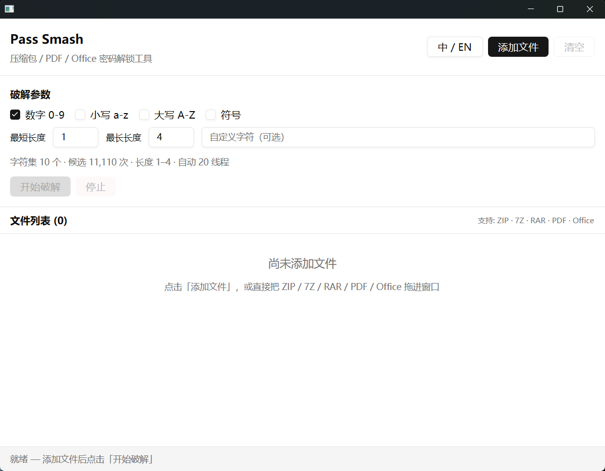

# Pass Smash

English | [中文](README.md)

A high-performance, low-memory desktop password unlocker written in Rust with
[GPUI Component](https://github.com/longbridge/gpui-component). Its
multi-threaded cracking engine makes full use of the CPU, while its natively
rendered GUI uses no Electron, Tauri, or other WebView wrapper.

## Features

- Crack passwords for **ZIP** / **7Z** / **RAR** / **PDF** / **Office** (docx/xlsx/pptx/doc)
- **Drag-and-drop** and **batch file selection**
- Charset options: digits / lower / upper / symbols / custom
- Min / max password length
- Multi-threaded brute force (auto CPU threads)
- High-performance, low-memory native GPUI interface with no Electron, Tauri,
  or WebView dependency
- Live progress, rate, and cancel
- **Chinese / English** UI toggle

## Screenshot



## Usage

1. Drag files in, or click **Add files** (ZIP / 7Z / RAR / PDF / Office)  
2. Choose charset and length range  
3. Click **Start**; **Stop** anytime  
4. Found passwords appear in the list  

Use **EN / 中** in the header to switch language.

## Build

Requires a recent Rust toolchain (edition 2024). On Windows, MSVC + Windows SDK are needed. First build pulls GPUI / Zed dependencies (slow).

```bash
cargo run --release
# binary: target/release/pass_smash.exe
```

On Windows, release builds hide the console window (`windows_subsystem = "windows"`). Debug builds keep a console for logs.


## Libraries (latest stable)

| Purpose | Crate |
|---------|--------|
| ZIP | `zip` 8.x |
| 7Z | `sevenz-rust2` 0.21 |
| RAR | `unrar` 0.5 (official UnRAR binding) |
| PDF | `lopdf` 0.44 |
| Office | `office-crypto` 0.2 |
| UI | `gpui` + `gpui-component` |

## Architecture

```
src/
  main.rs
  app.rs                 # UI / DnD / locale switch
  i18n.rs                # zh/en strings
  crack/
    types.rs
    charset.rs
    engine.rs
    handlers/
      zip.rs
      sevenz.rs
      rar.rs
      pdf.rs
      office.rs
fixtures/                # test samples
```

To add a format: implement `PasswordHandler`, register in `FileKind` and `handler_for`.

## Tests

## Release

Pushing a version tag triggers GitHub Actions to build Windows / Linux / macOS packages and publish a GitHub Release:

```bash
# Tag version must match Cargo.toml version, e.g. 0.1.0
git tag v0.1.0
git push origin v0.1.0
```

Assets:
- `pass_smash-windows-x64.zip`
- `pass_smash-linux-x64.tar.gz`
- `pass_smash-linux-arm64.tar.gz`
- `pass_smash-macos-arm64.tar.gz`


```bash
cargo test --bin pass_smash
```

## Disclaimer

For recovering your own forgotten passwords, authorized pentests, and security research only. Do not use against files you are not allowed to access.
